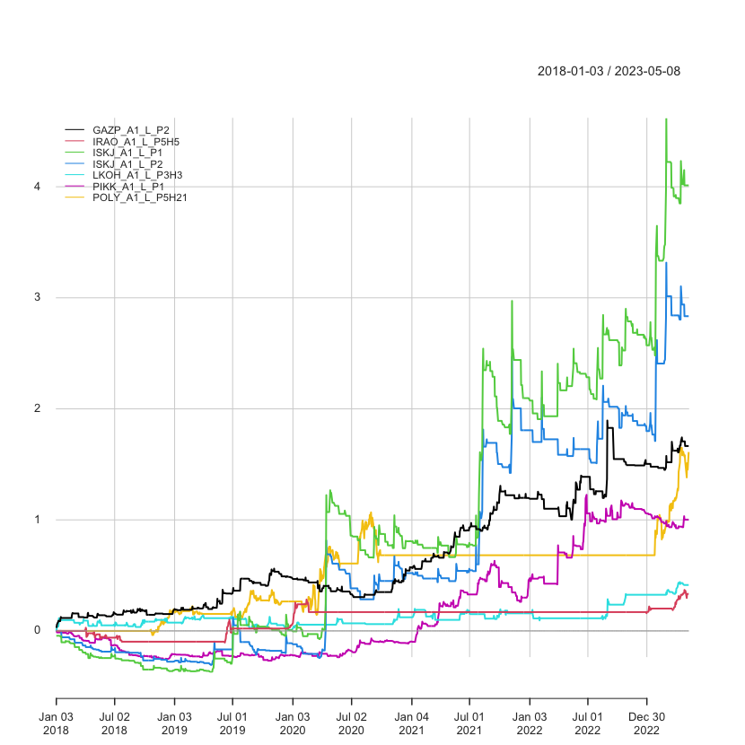
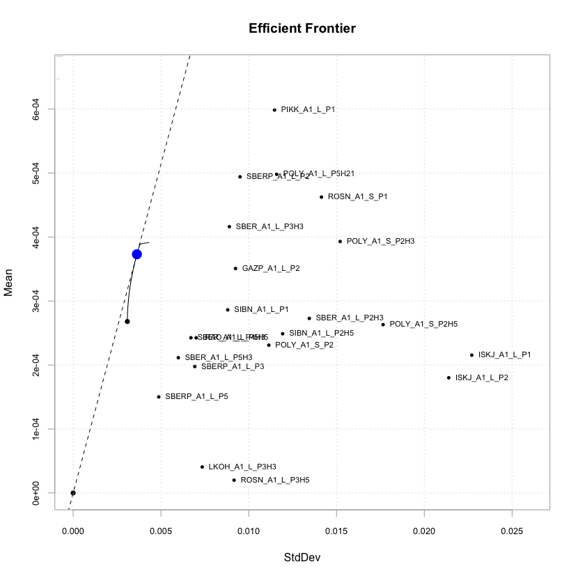
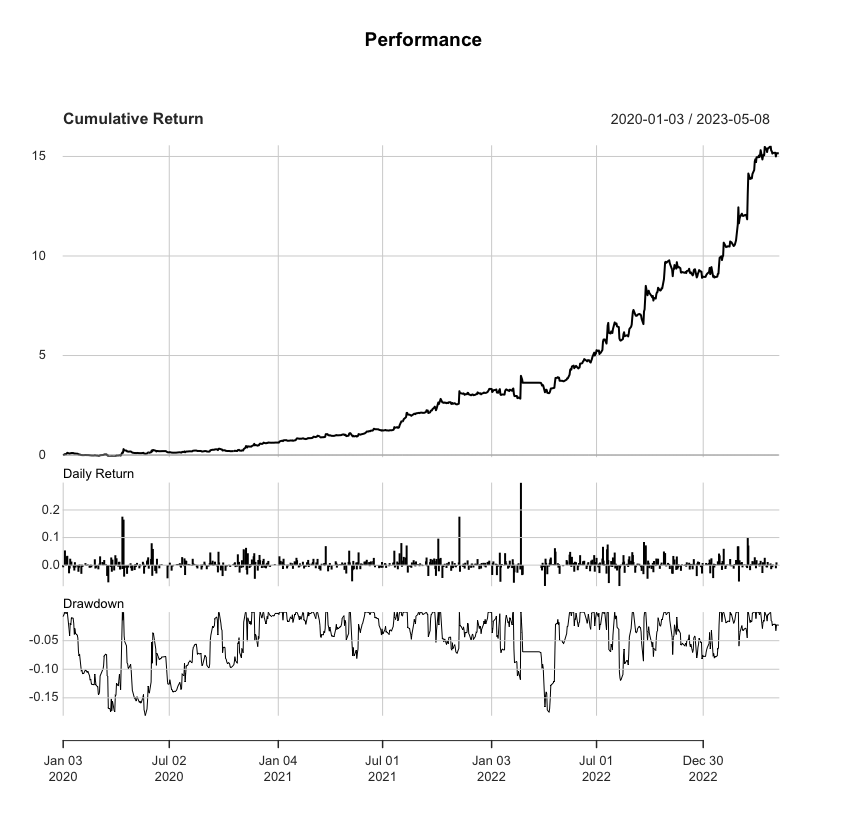
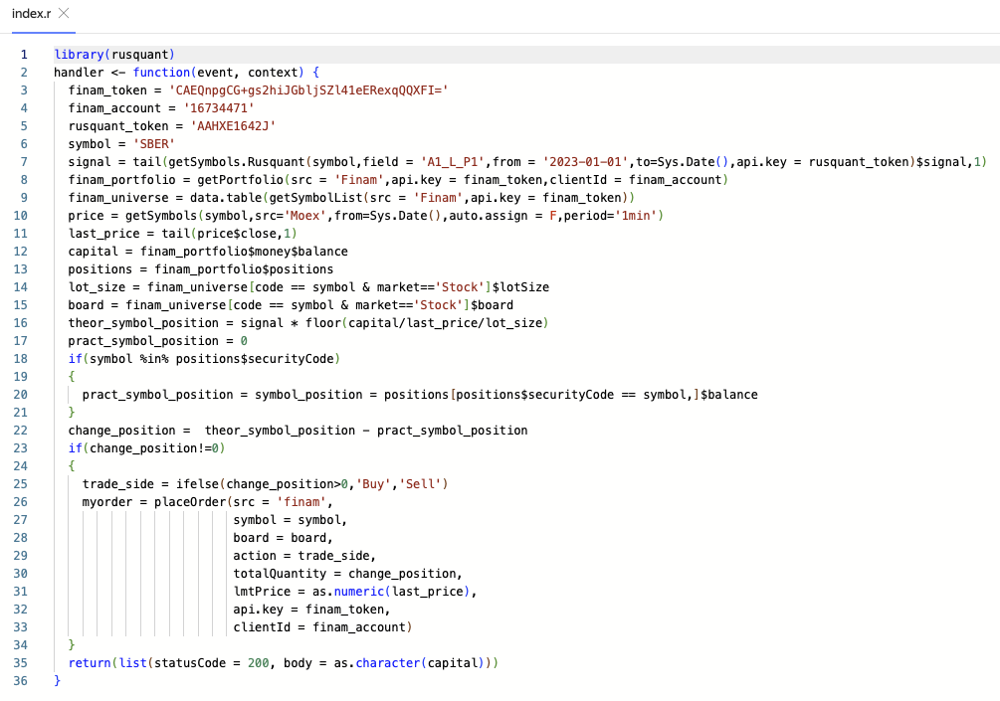
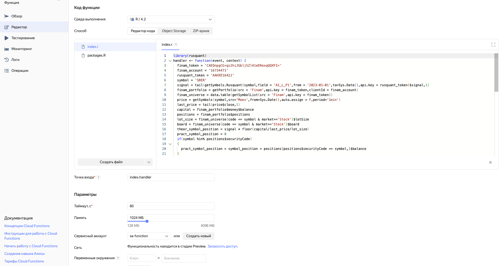
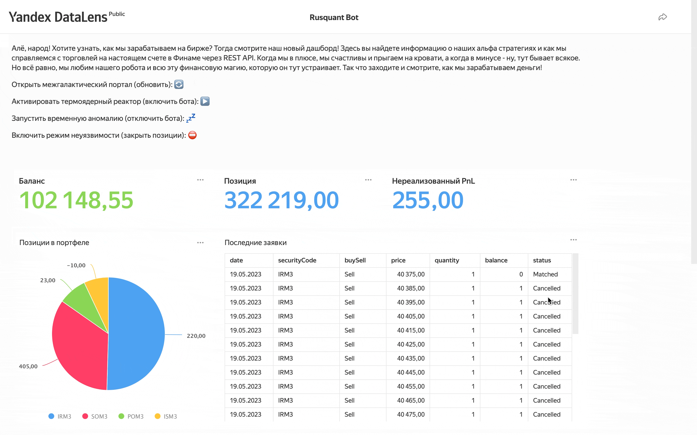

# Rusquant Bot 🚀

```shell
Сделан в рамках соревнования Хакатон «Финам Trade API» 
по созданию торговых систем на основе открытого торгового API «Финама»
```

Робот, создан на языке программирования R с использованием Finam Trade API. Представляет собой торговую систему, которая автоматически принимает решения о покупке и продаже фьючерсов в конце дня на основе альфа-стратегий.

Альфа (или альфа-стратегия) - это комбинация математической формулы, компьютерного кода и параметров, которая при добавлении к ним исторических данных способна прогнозировать будущие движения различный финансовых инструментов (определение из [книги](https://www.amazon.com/Finding-Alphas-Quantitative-Approach-Strategies/dp/1119057868)).

Торговый робот торгует портфель альфа-стратегий, который он выбирает по заданным пользователем критериям. Для удобства код разделен на 2 части: исследовательскую (файл quant.R) и торговую (tradebot.R).

В исследовательской части пользователь формирует набор альфа-стратегий, которые он собирается торговать, оценивает их риск-доходность и формирует портфель стратегий, который он будет торговать.

В торговой части реализована логика исполнения торговых сигналов.

## Требования   🛠️

Для локального запуска кода потребуется установка R и библиотеки rusquant.


Для установки с CRAN достаточно найти библиотеку в списке общих пакетов
или установить с использованием команды:

``` r
install.packages("rusquant")
```

Второй метод - это установка с Github, для этого необходима
установленная библиотека `devtools`.

``` r
# install.packages("devtools") # if not installed
# options(download.file.method = "libcurl") # if problems with "Error in utils::download.file(url, path...."

library(devtools)
install_github("arbuzovv/rusquant")
```

Торговый робот использует библиотки quantmod, xts и PerformanceAnalytics, которые будут автоматически загружены при установки библиотеки rusquant.

Для оптимизации портфеля альф требуется библиотека PortfolioAnalytics и библиотеки для оптимизации.
``` r
install.packages("PortfolioAnalytics")
install.packages("ROI")
install.packages("ROI.plugin.glpk")
install.packages("ROI.plugin.quadprog")
install.packages("PerformanceAnalytics")
```


Для запуска робота сперва исполняем файл quant.R который сформирует портфель альфа стратегий которым мы будем торговать.
Для ежедневной торговли в конце дня запускаем tradebot.R (можно использовать планировщих задач в локальном варианте или CRON для запуска в облаке).

## Технологии    🧑‍💻

Торговый робот создан таким образом, чтобы укладываться в современные тренды связанные с микросервисной архитекрутой и бессерверными вычислениями. В рамках данного хакатона был реализован микросервис по расчету альфа стратегий и написан для него [API](https://swagger.rusquant.ru). API реализован в [Yandex Cloud](https://cloud.yandex.ru). Разработанный робот способен запускаться в бессерверном режиме Yandex Cloud. Для анализа и управления роботом в бессерверном режиме можно использовать Data Lens. Ссылка на [фронтэнд](https://datalens.yandex/4l4yydg8alqou) разработанного торгового робота. Не смотря на более современный протокол GRPC - внутри библиотки rusquant используется REST API для того, чтобы торговых роботов можно было запускать на облачных платформах без дополнительных настроек.

Благодаря такому подходу можно запускать торговых роботов в облаке, что дает ряд преимуществ:

1.  Безопасность: робот хранится на сервере в облаке, а не на локальном компьютере, что делает его менее уязвимым для взлома или вирусных атак.

2.  Надежность: сервера в облаке обычно имеют высокий уровень надежности и доступности, что означает, что ваш торговый робот всегда будет работать, даже если у вас возникнут проблемы с локальным компьютером.

3.  Масштабируемость: использование серверов в облаке позволяет легко масштабировать робота, чтобы обрабатывать большие объемы данных и более сложные задачи.

4.  Удобство использования: торговый робот в облаке обычно может быть запущен и управляться из любого устройства с доступом в Интернет, что делает его очень удобным в использовании.

5.  Дешевизна: используются только ресурсы по требования - что позволяет уменьшить потребляемые компьютерные мощности почти до нуля.

## Исследовательская часть (количественный анализ)  📊
```shell
Описание того, что происходит в файле quant.R
```
Сначала робот выбирает альфа-стратегии с высокой доходностью по различным периодам времени, используя критерии Sharpe Ratio, процент прибыли за последний месяц и оценку оверфитинга стратегии. Затем робот получает данные по этим альфа-стратегиям и сигналам, которые они генерируют, за период с 2010 года по текущую дату. Для каждой альфа-стратегии робот рассчитывает ее будущую доходность и объединяет их в общую таблицу.


Затем робот создает портфель, состоящий из выбранных альфа-стратегий, используя различные ограничения на минимальную и максимальную долю каждой стратегии в портфеле, а также на общую долю портфеля, которую можно инвестировать в активы. Робот оптимизирует этот портфель для максимизации доходности при ограниченном риске, используя пакет PortfolioAnalytics.

Робот также строит границу эффективных портфелей по доходности и риску, чтобы показать, какой портфель находится на границе эффективности. 


Робот использует пакет PerformanceAnalytics для анализа доходности портфеля и его показателей, таких как Sharpe Ratio и Calmar Ratio.

Динамика доходности построенного портфеля выглядит следующим образом:


После выбранного портфеля альфа-стратегий сохраняются веса и выбранные стратегии для последующей торговли.

Данная исследовательская часть, может запускаться с пользователем с той периодичностью с которой он хочет ребалансировать портфель (каждый день, раз в месяц, раз в год, единожды)

## Торговая часть   📈💰
```shell
Описание tradebot.R
```
Данный торговый робот использует Rest API для взаимодействия с брокером Finam. Он осуществляет автоматическую торговлю на фондовой бирже. Для взаимодействия с Finam

Робот получает список символов, доступных для торговли, и вычисляет позиции, которые необходимо открыть для торговли. Для расчета размера позиции используется текущий баланс счета и заданный размер плеча.

Затем робот сравнивает рассчитанные позиции с текущим портфелем и определяет разницу. Для открытия новых позиций робот использует Rest API Финама для отправки лимитных заявок на биржу.

Робот ожидает 30 секунд, а затем проверяет статус своих ордеров. Если ордер не был исполнен, робот отменяет его и отправляет новый ордер с обновленным ценой.

В конце торгового дня робот сохраняет данные о своих позициях и сделках в формате CSV для последующего анализа.

Преимуществом данного торгового робота является возможность автоматической торговли на бирже с использованием Rest API, что позволяет сократить время, затрачиваемое на торговлю, и уменьшить возможные ошибки, вызванные человеческим фактором.

## Простые торговые роботы в облаке   💸
```shell
Описание папки yandexcloudbot
```
Тенденции в современного ПО такие, что пытаются максимально упростить код для конечного пользователя. Простой код позволяет проще привлекать новых пользователей и является более доступным для понимания происходящего.
Можно использовать для тестирования более простого робота, в которых отсутствует блоки с оптимизацией портфеля и управления заявками.
Созданная и загруженная в рамках хакатона библиотека позволяется писать торговых роботов всего в 36 строк кода - при этом исполняться этот код будет по настроенному расписанию в облаке.



При таком подходе не требуется думать о включенном компьютере или ждать закрытия дня для исполнения кода.

Для создания робота на Yandex Cloud необходимо создать клауд функцию в R и поместить туда содержимое папки yandexcloudbot.

Файл index.R представляет собой  код торгового робота

Файл packages.R представляет собой код для установки библиотеки rusquant

Таймаут рекомендуется установить 600 секунд (10 минут), а память до 1024Мб.



## Фронтэнд 🖥️

Для мониторинга безусловно можно пользоваться приложениями брокера.
Но иногда интереснее и полезнее взглянуть на те торговые метрики, которые необходимы для анализа торгуемой стратегии.
Для построения фронтэнда использовался Yandex Data Lens который позволяет в удобной форме визуализировать необходимые показатели.
[Ссылка](https://datalens.yandex/4l4yydg8alqou) на фронтэнд торгового робота разработанного в рамках Хакатона.



## Выполнение критериев оценки  📌

**Идея проекта:**

*Новизна:*

-   в рамках проекта была разработана API позволяющая упростить часть связанную с исследованием рынка. Данное API можно воспринимать как сервис "Worldquant по подписке"

-   разработана библиотека rusquant, которая содержит в себе методы работы с различными брокерами через API (Финам, Алор, Тинькофф)

-   благодаря созданной библиотеки rusquant появилась возможность запускать торговых роботов прямо из облака (Yandex Cloud)

*Использование открытых данных:*

-   в рамках проекта были реализованы удобные функции подключения к открытым данным Финам (экспорт котировок), Алор (API), Московская биржа (API), Mfd.ru (экспорт котировок), Poloniex, MarketWatch.

-   Для расчета альфа-стратегий используются данные загружаемые с Финам (экспорт котировок)

**Качество исполнения:**

*Дизайн:*

-   все основные функции собраны в библиотеку и размещены на [github](https://github.com/arbuzovv/rusquant), библиотека подготовлена и размещена на [CRAN](https://CRAN.R-project.org/package=rusquant)

*Функциональность:*

-   позволяет проводить количественный анализ, создавать и оценивать предполагаемую доходность портфеля, корректировать портфель до нужных весов, отправлять, отменять заявки

*Технологичность:*

-   см. подробнее [Технологии](#технологии)
